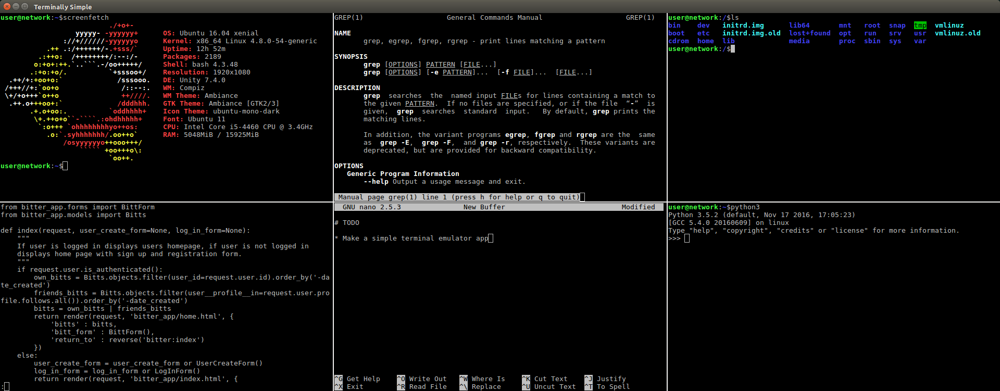

# TerminallySimple

This is a simple multi-terminal application. Unlike [_terminator_](https://en.wikipedia.org/wiki/Terminator_(terminal_emulator)) or [_tmux_](https://github.com/tmux/tmux/wiki) this application is __not__ meant to be modular. It displays only six terminals in in two rows. The app was tested only on Ubuntu 16.04.

## TODO:

* Add context menu for terminals: copy and paste options
* Make a shortcut for switching between terminals
* Add option for one additional row (_maybe_)
* Add a proper pythonic packaging (research PyPI and PyPUG)
* When _exit_ is executed destroy and re-spawn the current terminal

## Additional info

App was built using Gtk and Python. For detailed information look at _requirements.txt_ file.

